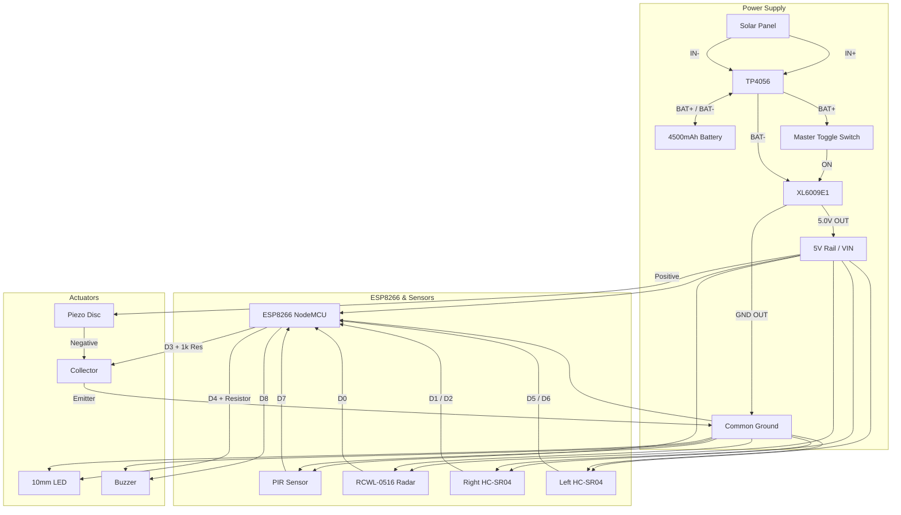

# CropCalm Edge Node - Final Wiring & Circuit Diagram

Since you are soldering this to a perfboard, **Common Ground** is the most important rule. Every single component must eventually connect to the same Ground (GND) line, or the sensors will not work.

## 1. Power Subsystem (The Engine)

This section converts erratic solar power into clean, stable 5V power for the whole board.

*   **Solar Panel (2.5W, 5-6V)**
    *   Positive (+) wire ➔ **TP4056** `IN+`
    *   Negative (-) wire ➔ **TP4056** `IN-`
*   **4500mAh 18650 Battery, TP4056, and Master Switch**
    *   Since you have the 4-pin TP4056, you must wire the load in parallel with the battery, but intercept the Positive line with your Master Switch.
    *   **TP4056** `BAT+` ➔ **Battery** Positive (+) AND **Toggle Switch** (Pin 1)
    *   **Toggle Switch** (Pin 2) ➔ **XL6009E1** `IN+`
    *   **TP4056** `BAT-` ➔ **Battery** Negative (-) AND **XL6009E1** `IN-`
*   **Boost Converter Output (Tuning Required)**
    *   *CRITICAL STEP:* Before connecting the ESP8266, use a multimeter to measure the XL6009E1 `OUT+` and `OUT-`. Use a small screwdriver to turn the gold screw on the blue potentiometer until the output reads exactly **5.0V**.
    *   **XL6009E1** `OUT+` (5.0V) ➔ **ESP8266** `VIN` (Voltage In pin)
    *   **XL6009E1** `OUT-` (GND) ➔ **ESP8266** `GND`

> [!WARNING]
> The ESP8266 `VIN` pin takes 5V. Do not connect 5V to the `3V3` pin, it will instantly fry the chip.

---

## 2. Input Sensors (The Eyes)

All sensors will run on the stable 5V rail provided by the XL6009E1.

### Right HC-SR04 Ultrasonic
*   `VCC` ➔ **ESP8266** `VIN` (5V Rail)
*   `GND` ➔ **ESP8266** `GND` (Common Ground Rail)
*   `TRIG` ➔ **ESP8266** `D1` (GPIO5)
*   `ECHO` ➔ **ESP8266** `D2` (GPIO4)

### Left HC-SR04 Ultrasonic
*   `VCC` ➔ **ESP8266** `VIN` (5V Rail)
*   `GND` ➔ **ESP8266** `GND` (Common Ground Rail)
*   `TRIG` ➔ **ESP8266** `D5` (GPIO14)
*   `ECHO` ➔ **ESP8266** `D6` (GPIO12)

### PIR Motion Sensor (HC-SR501)
*   `VCC` ➔ **ESP8266** `VIN` (5V Rail)
*   `GND` ➔ **ESP8266** `GND` (Common Ground Rail)
*   `OUT` ➔ **ESP8266** `D7` (GPIO13)

### Microwave Radar (RCWL-0516) - *Optional/Upgrade over PIR*
*   `VIN` ➔ **ESP8266** `VIN` (5V Rail)
*   `GND` ➔ **ESP8266** `GND` (Common Ground Rail)
*   `OUT` ➔ **ESP8266** `D0` (GPIO16)

---

## 3. Output Actuators (The Deterrents)

### 10mm Red LED (Visual Strobe)
*   `Anode` (Long leg) ➔ 220Ω Resistor ➔ **ESP8266** `D4` (GPIO2)
*   `Cathode` (Short leg) ➔ **ESP8266** `GND` (Common Ground Rail)

### Active Buzzer (Audible Alarm)
*   `Positive (+)` ➔ **ESP8266** `D8` (GPIO15)
*   `Negative (-)` ➔ **ESP8266** `GND` (Common Ground Rail)

### 40kHz Piezo Disc with NPN Transistor (Ultrasonic Deterrent)
*Wiring the BC547 or 2N2222 Transistor (Looking at the flat side: Left = Collector, Middle = Base, Right = Emitter)*

1.  **The Signal:** Connect **ESP8266** `D3` (GPIO0) ➔ 1kΩ Resistor ➔ Transistor `Base` (Middle pin).
2.  **The Ground:** Connect Transistor `Emitter` (Right pin) ➔ **ESP8266** `GND`.
3.  **The Power:** Connect the Piezo `Positive` wire to the **ESP8266** `VIN` (5V Rail).
4.  **The Switch:** Connect the Piezo `Negative` wire to the Transistor `Collector` (Left pin).
5.  **The Protection (Optional but recommended):** Place the 1N4148 Diode across the Piezo wires. The black stripe line on the diode must face the Positive (5V) side. This stops the piezo from sending dangerous voltage spikes backwards into the ESP8266.

---

## 4. Visual Summary

